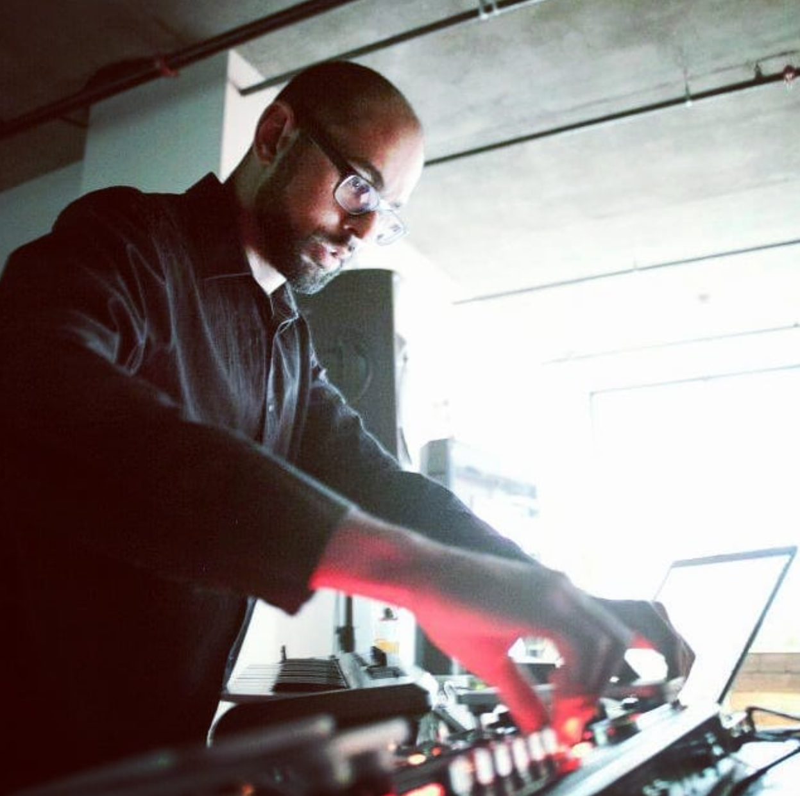
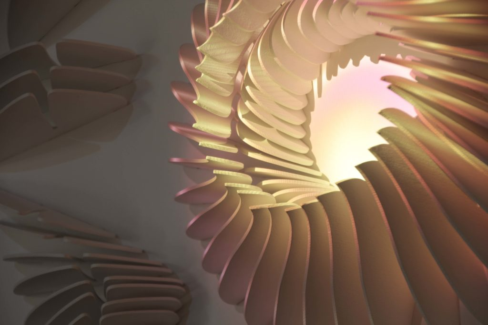
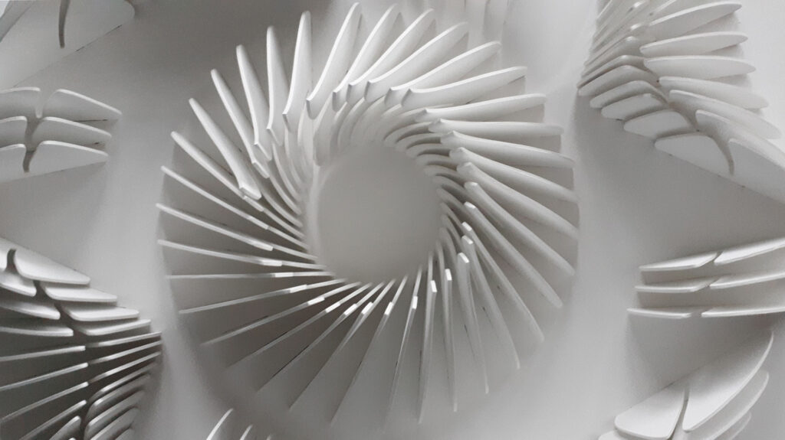
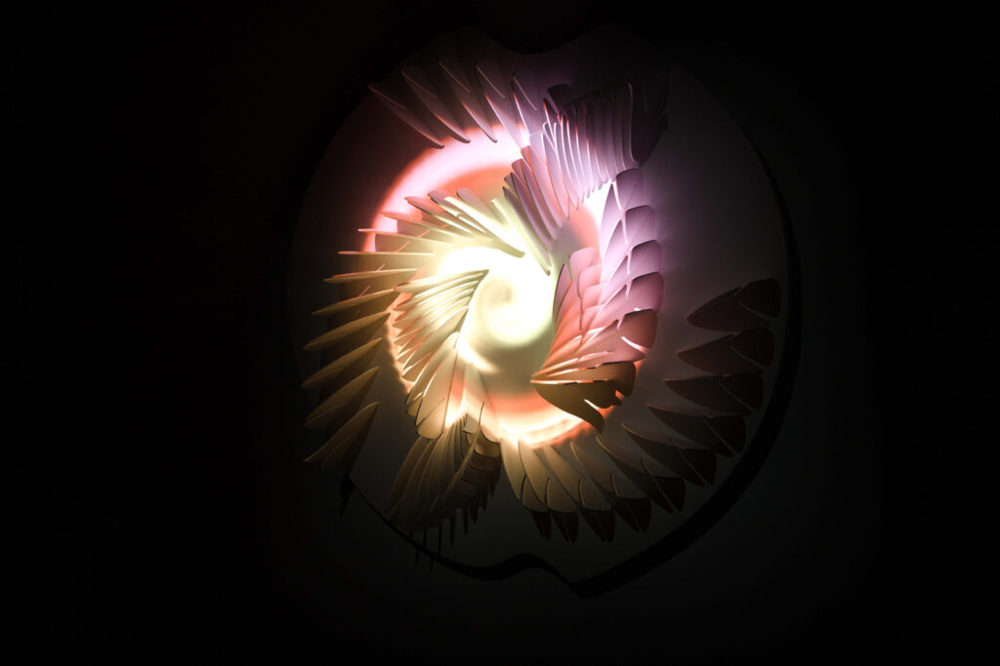

# "Isochrone"

## Qui?

<table>
  <tr>
    <td></td>
  </tr>
  
</table>

### Manuel Chantre

Concept, dessin technique paramétrique, production, ateliers : # Manuel Chantre

Contribution visuelle : Francis Tremblay

Participant·e·s aux ateliers : Sarra Boussoukaya, Madouba Diallo, Maité Muriel Ingar Diaz, Diego Jacazio, Nathalie Nguyen, Chloé Puigpinos et étudiants du Cégep André-Laurendeau

Production : Olivier Heaps-Drolet, Annie Lévesque, Patrick Akadji et Émilie Lévesque-Clément.

## Quand?

L'œuvre d'art était accessible au public au cours de l'hiver 2019-2020 entre 18h00 et 23h00. On peut supposer que la production de cette œuvre d'art a eu lieu à ce temps car aucune autre date n'est disponible.

## Où?

Cinéma,Cinémathèque Québécoise, Montréal (CA), 2020

MAPP_MTL, Never Apart, Montréal (CA), 2020-2019

Maison de la cutlture Marie-Uguay, Montréal (CA), 2019

Galerie SAT - Société des arts technologiques

Isochrone est inspirée du cercle en mouvement, un principe de croissance observé chez certains végétaux. La sculpture en bois, avec sa forme tridimensionnelle et son mouvement lumineux, illustre le concept d’isochronisme, qui évoque la simultanéité de deux phénomènes.

Cet intérêt pour le cycle de croissance des végétaux pourrait provenir des environs du Québec qui sont encore aujourd'hui dominés par le secteur agricole.

## Quoi?

<table>
  <tr>
    <td></td>
    <td></td>
  </tr>
    
  <tr>
    <td></td>
    <td></td>
  </tr>
    
  <tr>
    <td></td>
    <td></td>
  </tr>
</table>

<iframe title="vimeo-player" src="https://player.vimeo.com/video/535573224?h=816664253b" width="640" height="360" frameborder="0"    allowfullscreen></iframe>

### Objectifs de l'œuvre :

Les intentions de Manuel Chantre avec "Isochrone" sont de créer une expérience immersive qui explore la relation entre lumière, forme, et mouvement, en s’inspirant du cercle en mouvement comme symbole de croissance naturelle. L'œuvre vise à illustrer le concept d'isochronisme, c'est-à-dire la simultanéité de phénomènes différents, en utilisant des sculptures lumineuses pour évoquer la manière dont des éléments naturels et technologiques peuvent interagir de manière synchronisée. Le message principal est de souligner l'harmonie entre la nature et la technologie, tout en invitant le public à réfléchir sur la perception du temps et de l'espace à travers le mouvement et la lumière.

La pièce a été réalisée avec du Bois, peinture acrylique, lecteur de fichier vidéo, projecteur vidéo.

### Public ciblé :

Le public visé par l'œuvre comprend les amateurs d'art contemporain, ceux intéressés par les installations artistiques utilisant la lumière et la technologie ainsi que les professionnels et étudiants en art, design, et technologie.

### Aspects techniques :

Technologie d’éclairage LED : Utilisée pour produire des effets lumineux dynamiques.

Mécanismes de mouvement : Intégrés dans la sculpture pour simuler le cercle en mouvement.

Matériaux : Bois pour la structure de base de la sculpture, combiné avec la peinture acrylique pour optimiser la diffusion de la lumière par des projecteurs vidéo.

Système de contrôle : Programmation des séquences lumineuses et des mouvements à l’aide de contrôleurs électroniques et de logiciels de gestion de l’éclairage.

### Processus de création :

Le processus de création de "Isochrone" a impliqué plusieurs étapes clés :

Conception initiale : Manuel Chantre a développé le concept en s'inspirant de la croissance naturelle et des principes d’isochronisme. Cette phase a inclus des croquis et des maquettes pour visualiser l’interaction entre la forme et la lumière.

Développement technique : Création des prototypes en utilisant des matériaux comme le bois et des composants d'éclairage LED. Cela a impliqué la recherche et le choix des technologies adaptées pour obtenir les effets désirés.

Programmation : Développement des séquences lumineuses et des mouvements des sculptures, souvent à l’aide de logiciels spécialisés pour la gestion des effets lumineux et des moteurs de mouvement.

Montage et ajustements : Assemblage des sculptures et ajustements finaux pour assurer la synchronisation précise des éléments lumineux et mobiles, et tester l’impact visuel global.

Présentation : Installation de l'œuvre dans des espaces d'exposition appropriés et préparation des éléments interactifs pour permettre au public de vivre l'expérience comme prévu par l’artiste.

## Comment?

### Composante centrale :

L'élément clé de l'œuvre "Isochrone" est la sculpture lumineuse tridimensionnelle intégrant un mécanisme de mouvement synchronisé avec des effets d’éclairage LED.

### Fonctionnement :

Mouvement : Le mécanisme interne de la sculpture permet à ses parties de se bouger en imitant le cercle en mouvement.

Éclairage LED : Les LEDs sont programmées pour émettre des variations lumineuses qui réagissent au mouvement de la sculpture.

La sculpture évolue visuellement au fur et à mesure de son mouvement, permettant aux visiteurs d'observer des transformations lumineuses en temps réel. Cette dynamique aide à exprimer le concept d’isochronisme, en montrant comment deux éléments peuvent fonctionner en harmonie pour créer une expérience simultanée et intégrée. 

### Impact :

La composante centrale de Isochrone distingue l'œuvre dans le paysage multimédia par son intégration de la technologie lumineuse et du mouvement mécanique. En utilisant ces techniques crée une œuvre qui non seulement capte l'attention par sa beauté visuelle, mais aussi engage le public sur un plan intellectuel et sensoriel. Cette interaction entre lumière et mouvement offre une expérience immersive qui se distingue par son approche unique de la sculpture.

## Appréciation et commentaire personnel

Je présente cette pièce principalement de sa beauté visuelle. Dans un monde où l'art moderne peut être difficile à appréssier et où certains travaux semblent enveloppés de messages vagues, simplistes ou exagérés, il est rafraîchissant de découvrir une œuvre dont le sens est clair et, surtout, agréable à regarder. Cette œuvre se distingue par sa simplicité esthétique et clarté conceptuelle, offrant ainsi une expérience visuelle agréable.
