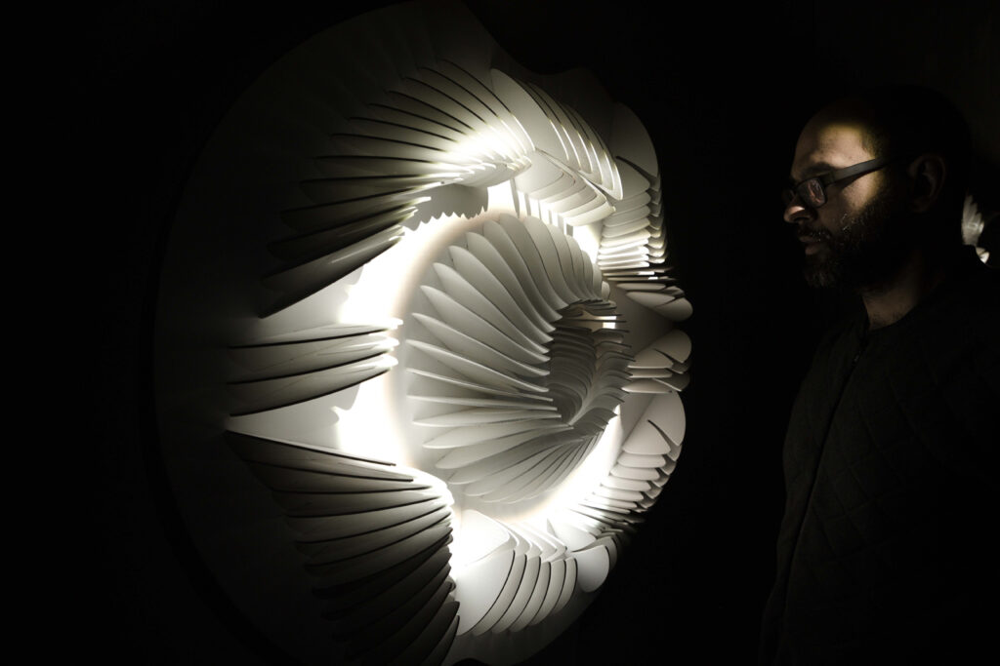

# "Isochrone"

## Description

<table>
  <tr>
    <td></td>
  </tr>
</table>

## Qui?

# Manuel Chantre

Concept, dessin technique paramétrique, production, ateliers : # Manuel Chantre

Contribution visuelle : Francis Tremblay

Participant·e·s aux ateliers : Sarra Boussoukaya, Madouba Diallo, Maité Muriel Ingar Diaz, Diego Jacazio, Nathalie Nguyen et Chloé Puigpinos

Production : Olivier Heaps-Drolet, Annie Lévesque, Patrick Akadji et Émilie Lévesque-Clément.

## Quand?
(Date de création et de présentation)

Date de création : Précisez quand l'œuvre a été créée. Mentionnez les périodes de conception, de développement, et de production si pertinent.

Date de première présentation : Indiquez la date à laquelle l'œuvre a été présentée au public pour la première fois.

Dates importantes : Ajoutez toute autre date significative liée à l'œuvre, comme les dates de tournées, d'expositions ou de remises de prix.

## Où?
(Contexte de présentation)

Lieu de présentation initiale : Mentionnez l'endroit où l'œuvre a été présentée pour la première fois (galerie, musée, festival, en ligne, etc.).

Contexte géographique et culturel : Donnez des détails sur le cadre culturel ou géographique qui a influencé la présentation de l'œuvre. Par exemple, si l'œuvre a été conçue pour un public spécifique ou si elle reflète des aspects culturels particuliers.

Autres lieux de présentation : Si l'œuvre a été présentée en plusieurs endroits, énumérez ces lieux avec les dates correspondantes.

## Quoi?
(Description de l'œuvre)

<table>
  <tr>
    <td></td>
    <td></td>
  </tr>
    
  <tr>
    <td></td>
    <td></td>
  </tr>
    
  <tr>
    <td></td>
    <td></td>
  </tr>
</table>

Description générale : Donnez une vue d'ensemble de l'œuvre. Qu'est-ce que c'est ? (installation, performance, vidéo, réalité virtuelle, etc.)

Objectifs de l'œuvre : Expliquez les intentions de l'auteur ou de l'équipe. Quel message ou expérience souhaite-t-elle transmettre ?

Public cible : Qui est le public visé par cette œuvre ?

Aspects techniques : Décrivez les aspects techniques importants, comme les technologies utilisées, les supports ou les médiums exploités.

Processus de création : Fournissez des détails sur la manière dont l'œuvre a été développée. Cela peut inclure des éléments comme l'écriture du scénario, la composition musicale, la programmation, etc.

## Comment?
(Une composante centrale à l'œuvre et son fonctionnement)

Composante centrale : Identifiez l'élément clé qui caractérise l'œuvre. Cela pourrait être une technologie spécifique, une approche narrative, ou une interaction particulière avec le public.

Fonctionnement : Expliquez comment cette composante centrale opère dans l'œuvre. Comment contribue-t-elle à l'expérience globale ? Quel rôle joue-t-elle dans l'engagement du public ou dans l'atteinte des objectifs de l'œuvre ?

Impact : Discutez de l'impact de cette composante sur la réception de l'œuvre. En quoi cet élément distingue-t-il l'œuvre dans le paysage multimédia ?

## Appréciation et commentaire personnel

( Pourquoi avoir choisi cette oeuvre)
