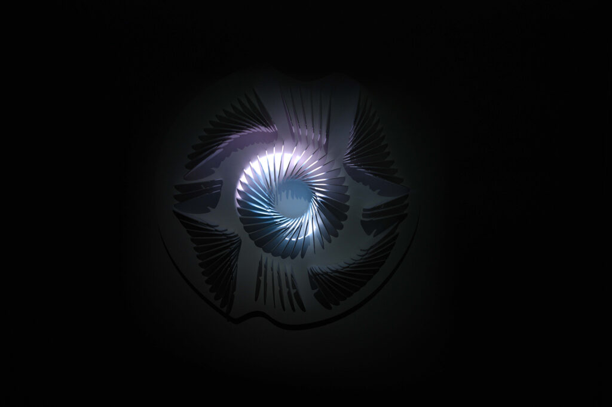

# "Isochrone"

## Description

## Qui?

<table>
  <tr>
    <td></td>
  </tr>
  
</table>

# Manuel Chantre

Concept, dessin technique paramétrique, production, ateliers : # Manuel Chantre

Contribution visuelle : Francis Tremblay

Participant·e·s aux ateliers : Sarra Boussoukaya, Madouba Diallo, Maité Muriel Ingar Diaz, Diego Jacazio, Nathalie Nguyen, Chloé Puigpinos et étudiants du Cégep André-Laurendeau

Production : Olivier Heaps-Drolet, Annie Lévesque, Patrick Akadji et Émilie Lévesque-Clément.

## Quand?

L'œuvre d'art était accessible au public au cours de l'hiver 2019-2020 entre 18h00 et 23h00. On peut supposer que la production de cette œuvre d'art a eu lieu à ce temps car aucune autre date n'est disponible.

## Où?

Cinéma,Cinémathèque Québécoise, Montréal (CA), 2020

MAPP_MTL, Never Apart, Montréal (CA), 2020-2019

Maison de la cutlture Marie-Uguay, Montréal (CA), 2019

Galerie SAT - Société des arts technologiques 

Isochrone est inspirée du cercle en mouvement, un principe de croissance observé chez certains végétaux. La sculpture en bois, avec sa forme tridimensionnelle et son mouvement lumineux, illustre le concept d’isochronisme, qui évoque la simultanéité de deux phénomènes.

Cet intérêt pour le cycle de croissance des végétaux pourrait provenir des environs du Québec qui sont encore aujourd'hui dominés par le secteur agricole.

## Quoi?
(Description de l'œuvre)

<table>
  <tr>
    <td></td>
    <td></td>
  </tr>
    
  <tr>
    <td></td>
    <td></td>
  </tr>
    
  <tr>
    <td></td>
    <td></td>
  </tr>
</table>

Description générale : Donnez une vue d'ensemble de l'œuvre. Qu'est-ce que c'est ? (installation, performance, vidéo, réalité virtuelle, etc.)

Objectifs de l'œuvre : Expliquez les intentions de l'auteur ou de l'équipe. Quel message ou expérience souhaite-t-elle transmettre ?

Public cible : Qui est le public visé par cette œuvre ?

Aspects techniques : Décrivez les aspects techniques importants, comme les technologies utilisées, les supports ou les médiums exploités.

Processus de création : Fournissez des détails sur la manière dont l'œuvre a été développée. Cela peut inclure des éléments comme l'écriture du scénario, la composition musicale, la programmation, etc.

## Comment?
(Une composante centrale à l'œuvre et son fonctionnement)

Composante centrale : Identifiez l'élément clé qui caractérise l'œuvre. Cela pourrait être une technologie spécifique, une approche narrative, ou une interaction particulière avec le public.

Fonctionnement : Expliquez comment cette composante centrale opère dans l'œuvre. Comment contribue-t-elle à l'expérience globale ? Quel rôle joue-t-elle dans l'engagement du public ou dans l'atteinte des objectifs de l'œuvre ?

Impact : Discutez de l'impact de cette composante sur la réception de l'œuvre. En quoi cet élément distingue-t-il l'œuvre dans le paysage multimédia ?

## Appréciation et commentaire personnel

( Pourquoi avoir choisi cette oeuvre)
